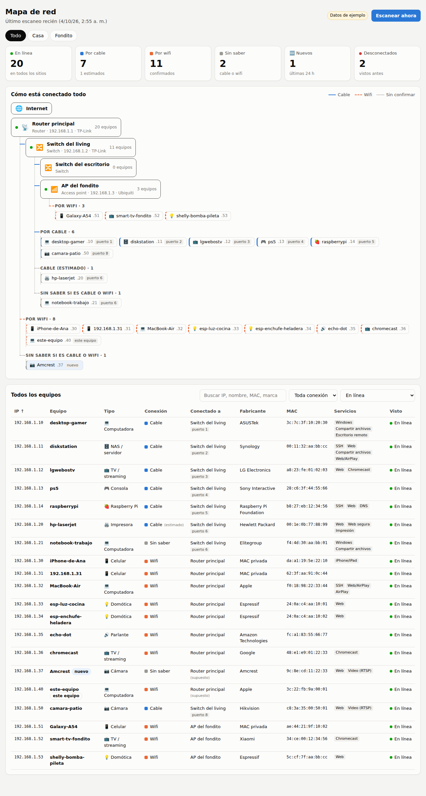

# Mapa de Red

Dashboard para ver **qué hay conectado en la red de casa y del fondito**: cada IP,
qué equipo es, la marca, de qué router/switch/access point cuelga y si está
**por cable o por wifi**.



## Cómo usarlo

Necesitás Python 3.11 o más nuevo. No hay que instalar paquetes de Python.

```bash
# 1. Ver cómo se ve, con datos de ejemplo (no escanea nada):
python3 -m netmap demo
#    abrí http://localhost:8765

# 2. Usarlo con tu red de verdad:
cp config.example.toml config.toml     # y editalo (ver abajo)
sudo python3 -m netmap                 # escanea y abre el dashboard en http://localhost:8765
```

Se tiene que correr en **una PC conectada a tu red** (no funciona desde la nube).
Con `sudo` (o como administrador en Windows) detecta más equipos y más datos.

Recomendado, para identificar mejor cada equipo:

- **nmap**: `sudo apt install nmap` / `brew install nmap` / [nmap.org](https://nmap.org/download) en Windows.
- **Lista de fabricantes** (para ver la marca de cada equipo aunque no tengas nmap):
  `python3 -m netmap update-oui`

Otros comandos:

```bash
python3 -m netmap scan                     # escanea una vez y muestra una tabla en la terminal
python3 -m netmap serve --host 0.0.0.0     # para abrir el dashboard desde el celular
```

## Qué te muestra

- **Resumen**: equipos en línea, cuántos por cable, por wifi, sin saber, nuevos en las últimas 24 h y desconectados.
- **Mapa** en árbol: Internet → router → switches / access points → equipos, separado por sitio (Casa / Fondito).
  Línea llena = cable, rayada = wifi, punteada = sin confirmar.
- **Tabla** con todo: IP, nombre, tipo (celular, TV, cámara, impresora…), conexión, a qué está conectado
  (y en qué puerto), fabricante, MAC, servicios abiertos y cuándo se vio por última vez.
- Tocando un equipo ves el detalle y le podés **poner nombre**, corregir el tipo o marcar a mano si va por cable o wifi.
- Re-escanea solo cada 15 minutos mientras está abierto (configurable) y avisa de **equipos nuevos**.

## ¿Cómo sabe si algo está por cable o por wifi?

Desde afuera no se puede ver con certeza, así que usa estas fuentes, de más a menos confiable:

| Fuente | Qué hace falta | Resultado |
|---|---|---|
| Lo que marques a mano en el dashboard | nada | confirmado |
| Lista de clientes wifi del router / AP | `wifi_clients_command` en el config (OpenWrt, MikroTik, Ubiquiti, etc. por SSH) | confirmado |
| Tabla de MAC de un switch administrable | SNMP activado + `snmpwalk` instalado | confirmado, con número de puerto |
| La PC que escanea | nada | confirmado |
| MAC privada/aleatoria, tipo de equipo (celular, enchufe inteligente…) | nada | **estimado** |

Los routers de los proveedores de internet normalmente no dejan consultar nada de esto;
en ese caso vas a ver muchos "estimados" y lo más práctico es marcarlos a mano una vez.
Si en un puerto de switch aparecen varios equipos, se avisa que detrás hay un switch o AP sin administrar.

## El fondito

- **Misma red que la casa** (repetidor, AP o cable desde la casa): poné la misma subred en los dos sitios
  y definí el AP del fondito en `[[infra]]` con `site = "fondito"`. Los equipos se asignan al fondito
  cuando aparecen en el wifi de ese AP (con `wifi_clients_command`) o cuando les elegís
  "Conectado a: AP del fondito" en el dashboard.
- **Red separada** (otro router con otra subred): poné su subred en el sitio "fondito". Si desde la casa
  no llega, corré el escáner en una PC del fondito y mandá el resultado al dashboard de la casa:

  ```bash
  # en la PC de la casa
  sudo python3 -m netmap serve --host 0.0.0.0 --token una-clave
  # en la PC del fondito
  sudo python3 -m netmap scan --site fondito --upload http://IP-DE-LA-PC-DE-CASA:8765 --token una-clave
  ```

## Privacidad

Todo queda en tu PC, en la carpeta `data/` (no se sube nada a internet). El dashboard no tiene contraseña:
por defecto solo se abre desde la misma PC; si usás `--host 0.0.0.0`, cualquiera en tu red lo puede ver.
Escaneá solamente redes que sean tuyas.

## Tests

```bash
python3 -m unittest -v tests.test_netmap
```
